# Informações do Projeto
`CoolDowny`  

Trabalho Interdisciplinar - Aplicacões Web

`ADS/SI`

`Semestre 1`

## Participantes

Os membros do grupo são: 
- Igor Leal Soares
- Bianca Garcia
- Rafael Lage Batista
- Jhuan Neto Santos Pires
- Pedro Arthur Silva Senra

> Inclua a lista dos membros da equipe com seus nomes completos.

# Estrutura do Projeto

1. [Contexto](./docs/1-Contexto.md)
2. [Especificações do Projeto](./docs/2-Especificação.md)
3. [Projeto da Interface](./docs/3-Interface.md)
4. [Gerenciamento do Projeto](./docs/4-Gerenciamento-Projeto.md)
5. [Implementação](./docs/5-Implementação.md)
6. [Referências](./docs/8-Referências.md)
7. [Apresentação do trabalho](./docs/apresentacao) 

## Pasta docs

Esta pasta arquiva a documentação dos projetos.

Na pasta `docs`, há uma subpasta `images` que deve arquivar todas as
imagens utilizadas para a elaboração do documento.

## Pasta src

Este diretório armazena o código fonte do projeto e adota uma hierarquia
básica de projetos Web simples, que utilizam as tecnologias HTML, CSS e
JavaScript.

### Links Úteis:

Aprenda Markdown e use-o para documentar o projeto  

> [Sintaxe básica de gravação e formatação no GitHub](https://guides.github.com/features/mastering-markdown/)

> [Suporte Github](https://help.github.com/pt/github/writing-on-github/getting-started-with-writing-and-formatting-on-github)

## Problema
Não é uma surpresa para todos que durante a pandemia, devido ao pouco contato que a população tinha, problemas como o isolamento social ou a dificuldade em socializar começaram a surgir. Junto deles, também veio o vício em jogos online, já que muitas pessoas presas dentro de suas casas, começaram a se afundar e ficaram presos até hoje nesse tipo de jogo.

## Objetivo do projeto
Dessa forma, para resolver esse problema dos vícios em jogos online, o objetivo que foi pensado, foi o de criar um site capaz de ajudar as pessoas a melhorarem e largarem ou controlar esse problema. Dois objetivos específicos que podem ser citados que o site pretende resolver é o de ajudar pessoas a controlarem o tempo que ficam no jogo e também ajudar as pessoas com esse problema a socializarem e sair mais de casa para aproveitar a vida da melhor maneira.

## Justificativa
É de extrema importância trabalhar com esta aplicação porque não é saudável para essas pessoas ficarem presas às telas, isso limita e estraga a vida delas completamente, por isso precisam de ajuda para isso. As razões para a escolha dos 2 objetivos específicos foi porque parece ser a melhor forma de atacar o problema central, que é o isolamento.

## Público-Alvo
O público-alvo do site são as pessoas que já não tem controle e estão viciadas nos jogos online, jovens que perdem sua juventude e passam a vida em frente às telas prejudicando seu desenvolvimento como pessoa ou até pessoas mais velhas com sites de apostas, que acabam apostando sem parar e compulsivamente, podendo até sofre de vários prejuízos para si mesmo.

## Matriz
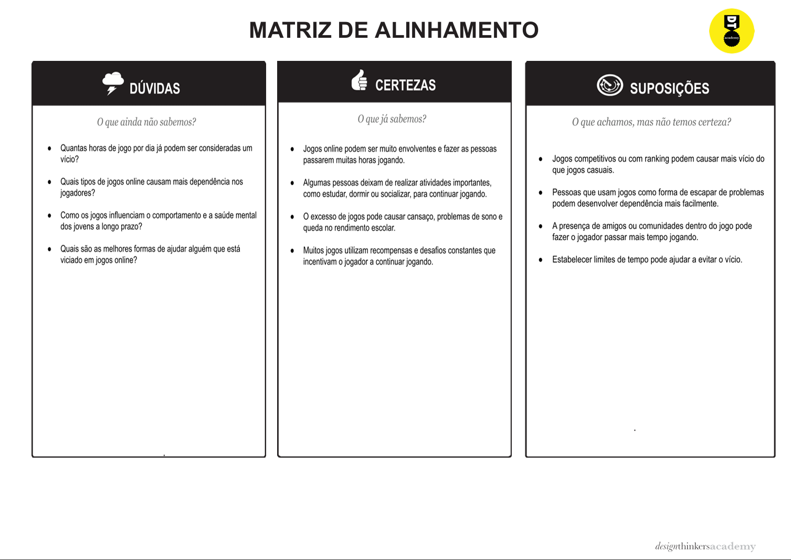

## Mapa de Stakeholder
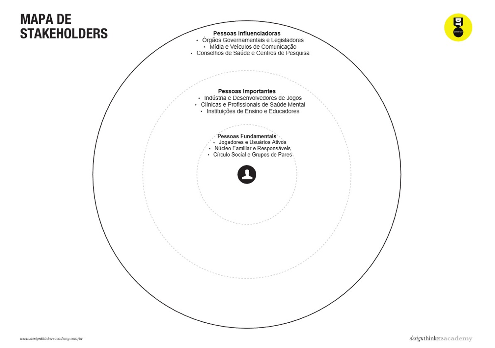

## Personas
Persona 1:
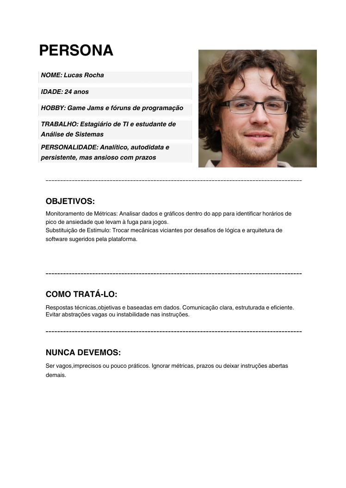
>
Persona 2:
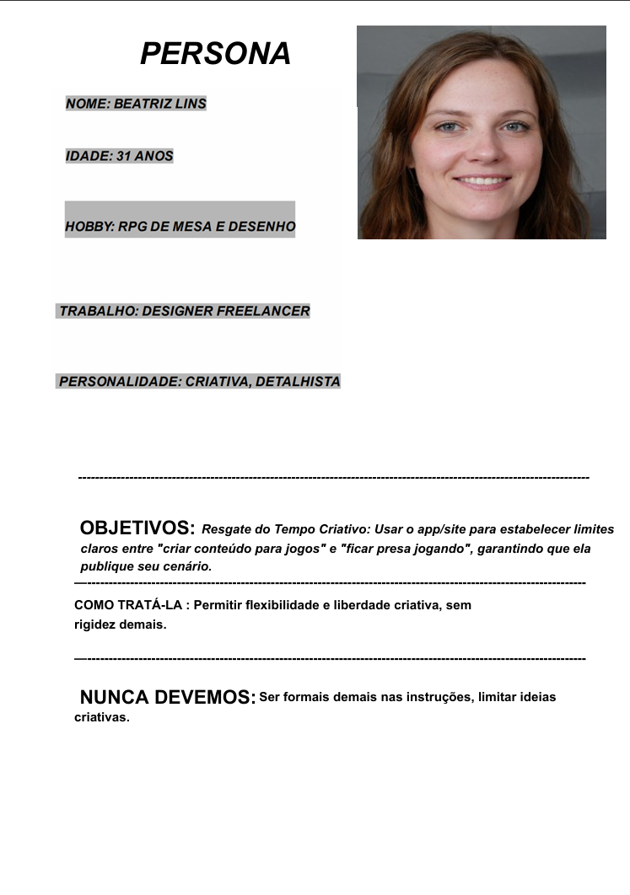
>
Persona 3:
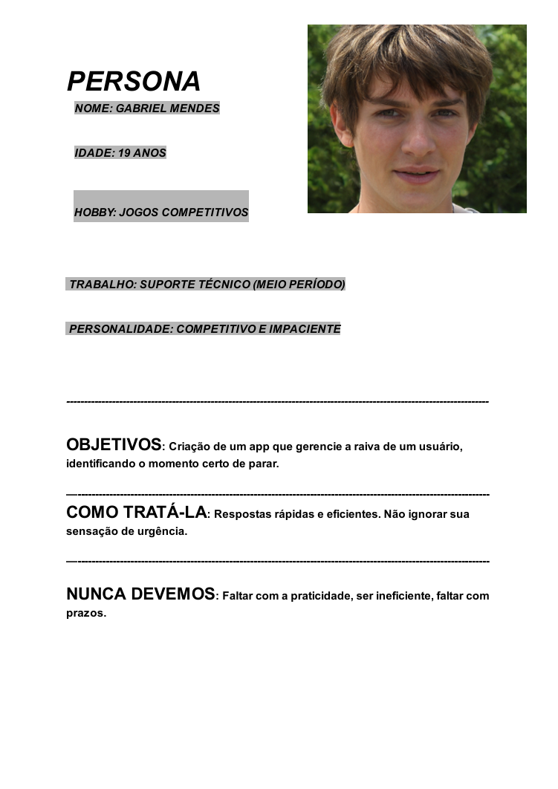

## Histórias de Usuários
História 1 - Eu como: Jogador de LOL Preciso de: Diminuir o tempo que fico jogando Para/Porque: Quero investir meu tempo em outras coisas

História 2 - Eu como: Streamer de jogos Preciso de: Ver quanto tempo fico em cada jogo Para/Porque: Quero ter controle sobre minha rotina

História 3 - Eu como: Jogador preocupado com o bem-estar físico. Preciso de: Receber um alerta a cada 1 hora de jogo contínuo. Para/Porque: Quero lembrar de levantar, me alongar e beber água para evitar o sedentarismo.

História 4 - Eu como: Trabalhador remoto. Preciso de: Bloquear o acesso a jogos durante o horário comercial. Para/Porque: Preciso manter o foco total nas minhas entregas profissionais e evitar distrações.

História 5 - Eu como: Estudante que precisa melhorar a produtividade. Preciso de: Definir um limite diário de tempo para jogos. Para/Porque: Quero garantir que minhas tarefas e estudos sejam concluídos antes de gastar tempo jogando.

História 6 - Eu como: Jogador competitivo que quer melhorar meu desempenho. Preciso de: Receber um relatório com o tempo total jogado e pausas feitas durante o dia. Para/Porque: Quero analisar minha rotina e ajustar meus horários para jogar com mais qualidade e menos cansaço mental.

## Proposta de Valor
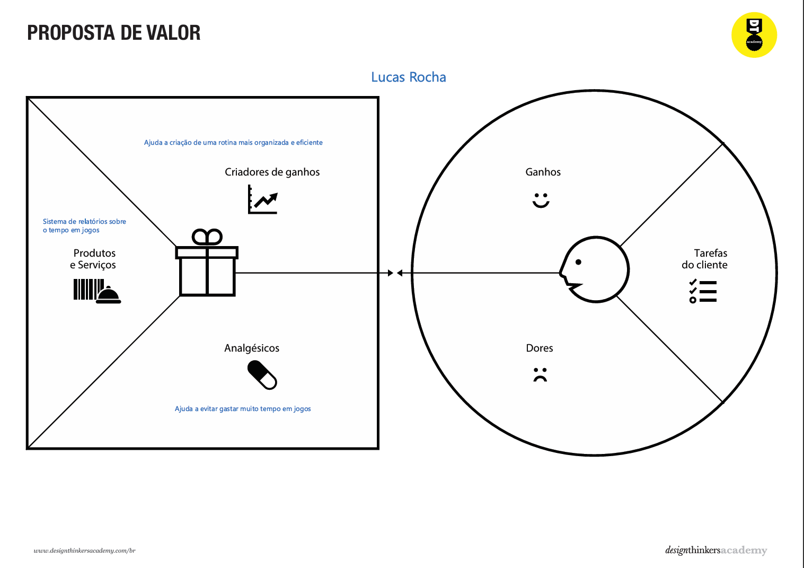

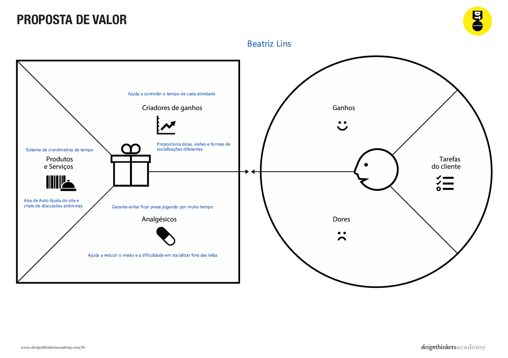

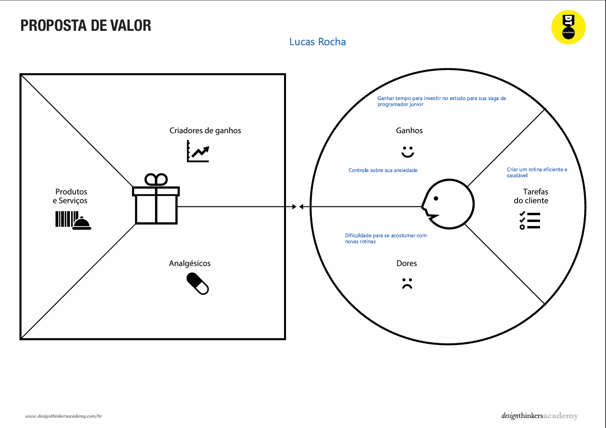

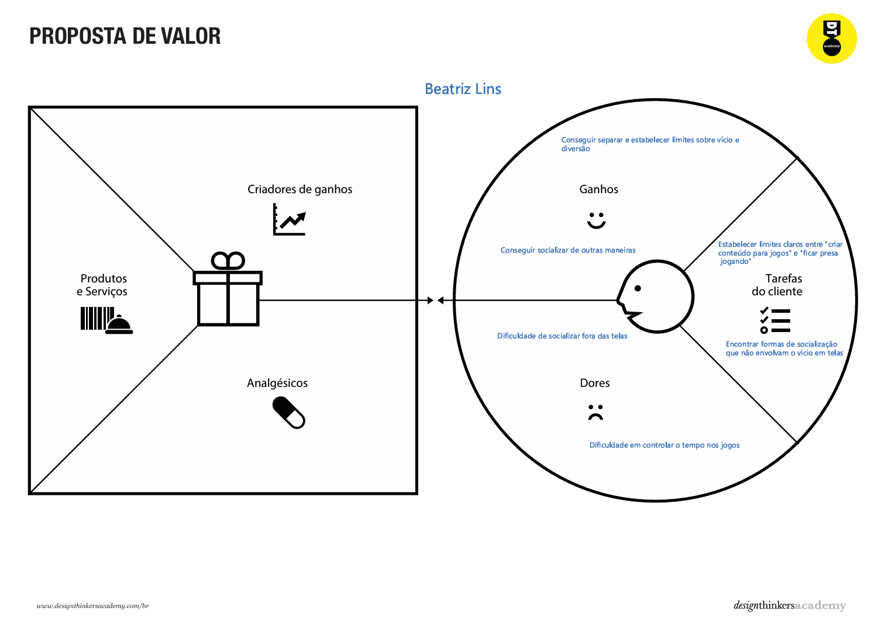

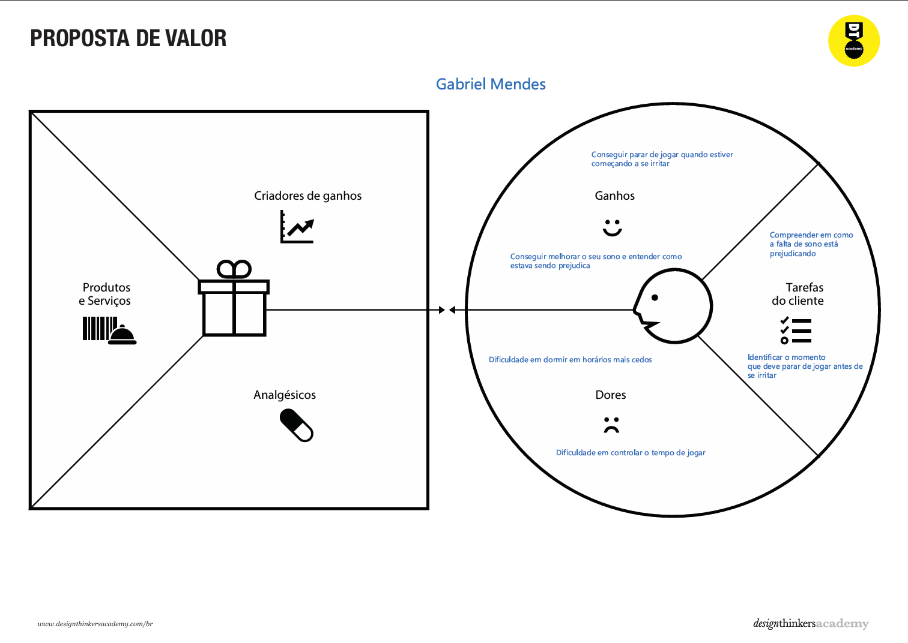

## Wireframe com Fluxo do Usuário
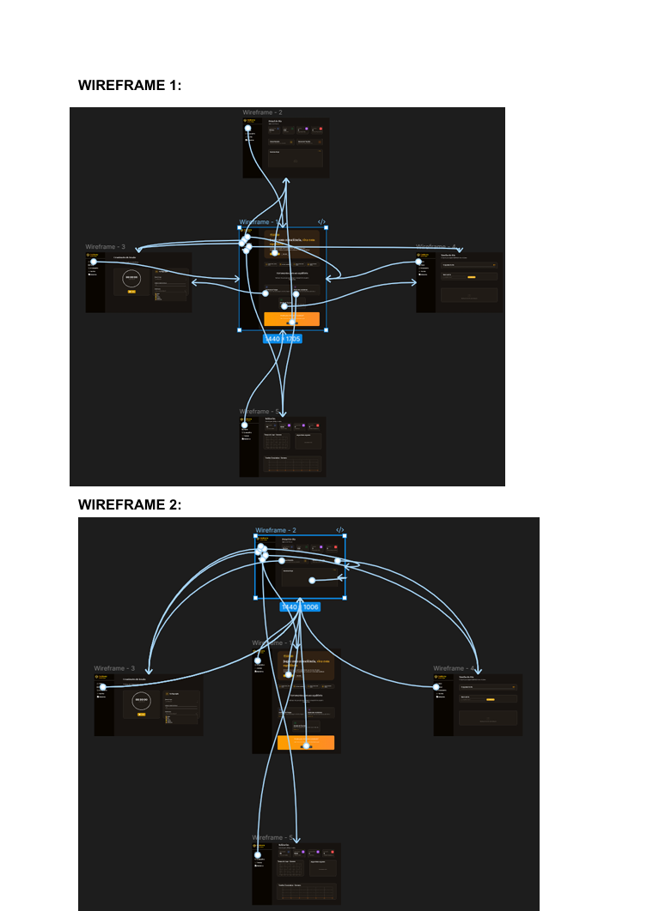
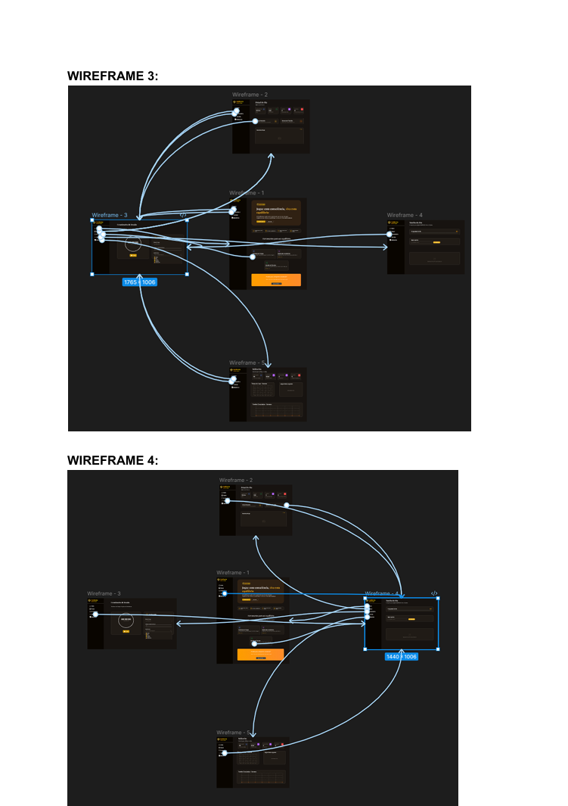
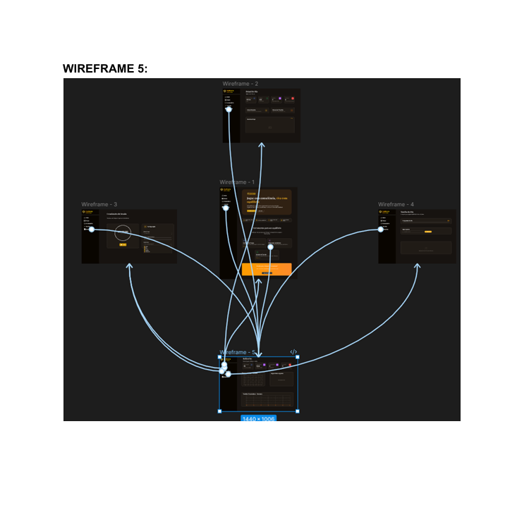

## Ferramentas Utilizadas
Visual Studio Code

Figma

Discord

Github

## Organização da equipe e divisão de papéis
Desenvolvimento e Documentação: Igor Leal Soares

Desenvolvimento: Rafael Large Batista

Design/UX: Bianca Garcia

Design e Desenvolvimento: Pedro Arthur Silva Senra

Pesquisa: Jhuan Neto Santos Pires

## Referências Bibliográficas
Referências utilizadas para o trabalho:
> [G1](https://g1.globo.com/ce/ceara/noticia/2025/12/17/vicio-em-apostas-online-atinge-milhoes-no-brasil-e-ja-e-considerado-problema-de-saude-publica.ghtml)

> [Site de Combate ao Vícios em Jogos Digitais](https://jogadoresanonimos.com.br)

